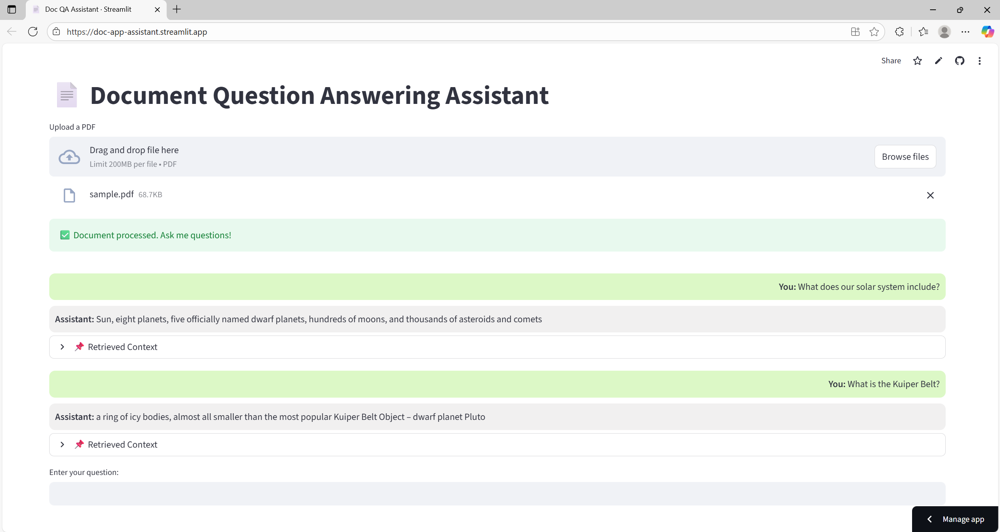
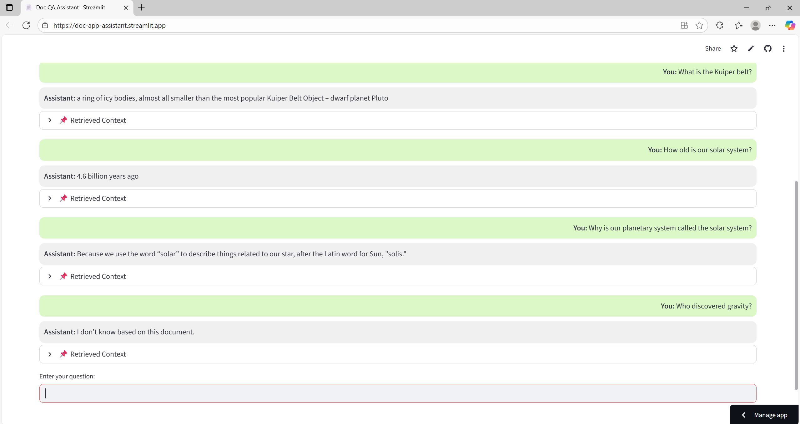

# Document Question Answering Assistant

This repository contains an example **PDF-based Question Answering assistant** that demonstrates how to combine **Large Language Models (LLMs)** with **retrieval techniques** to build grounded, reliable applications.

Instead of relying on a pre-trained model’s general knowledge, this assistant is designed to work **only with the content of the document you provide**. You upload a PDF, ask questions, and the system retrieves the most relevant parts of the text before generating an answer. If the assistant cannot find a meaningful answer in the document, it will not try to *hallucinate*. Instead, it responds with:

*"I don’t know based on this document."* 

This makes the project a simple but powerful example of **Retrieval-Augmented Generation (RAG)**, a widely used approach in modern LLM applications. It highlights how AI can be grounded in external data sources, ensuring **accuracy**, **transparency**, and **domain-specific answers**.

> **NOTE**: This project runs fully locally and does **not require any API keys**.

## Tech Stack

- [PyPDF2](https://pypi.org/project/PyPDF2/) - Extracts raw text from uploaded PDF
- [Sentence Transformers](https://www.sbert.net/) - Generates dense embeddings for semantic similarity
- [Hugging Face Transformers](https://huggingface.co/google/flan-t5-base) - Instruction-tuned LLM (`google/flan-t5-base`) used to generate answers from retrieved context
- [FAISS](https://github.com/facebookresearch/faiss) - Vector store for fast similarity search
- [Streamlit](https://streamlit.io/) - Web interface for uploading PDFs and asking questions

## Repository Structure

```
Doc-QA-Assistant/
├── screenshots/             # Demo Screenshots
│   ├── Q1.png
│   ├── Q2.png
│   ├── Q3.png
│   └── Q4.png
├── src/
│   ├── app.py               # DocQAAssistant class - Core QA pipeline
│   └── utils.py             # Utility functions
├── README.md
├── requirements.txt         # Dependencies
├── sample.pdf               # Example document
└── streamlit_app.py         # UI entry point                
```

## Getting Started

### 1. Clone the repository

```
git clone https://github.com/bhakuni27/Doc-QA-Assistant.git
cd Doc-QA-Assistant
```

### 2. Install dependencies

Ensure you have **Python 3** and **pip** installed. If not, you can download Python from [python.org](https://www.python.org/).
```
pip install -r requirements.txt
```

### 3. Run the Streamlit app

```
streamlit run streamlit_app.py
```

### 4. Upload a PDF & Ask Questions

- Upload `sample.pdf` (included in repo) or your own PDF
- Example questions for sample.pdf:
    - “What does our solar system include?”
    - “What is the Kuiper Belt?”
    - “Who discovered gravity?” → “I don’t know based on this document.”

## Demo

Here are some example interactions with the assistant:





